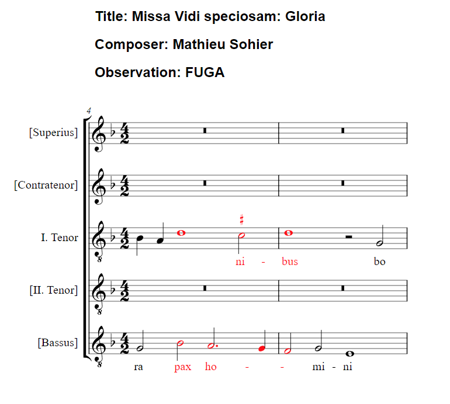

# CRIM Intervals Highlighter React App

The CRIM Intervals Highlighter React App is a cutting-edge web application designed for musicologists, researchers, and enthusiasts focusing on the analysis of musical intervals within the context of the CRIM (Citations: The Renaissance Imitation Mass) project. Leveraging the [Enhancing Music Notation Addressability (EMA) expressions](https://github.com/music-addressability/ema), this tool allows for the visualization and highlighting of specific intervals or passages within music scores, utilizing URLs to music pieces in MEI (Music Encoding Initiative) format. When used with CRIM intervals, it is particularly adept at enabling users to focus on and analyze distinct sections of a score.

## Features

- **Dynamic Music Score Rendering:** Renders music scores from MEI format URLs.
- **EMA Expression and CRIM Interval Highlighting:** Highlights sections of a music score based on Enhancing Music Notation Addressability (EMA) expressions and can be used in conjunction with specified [CRIM](https://github.com/HCDigitalScholarship/intervals) intervals, allowing for in-depth analysis of specific musical elements.
- **User-Friendly Interface:** Provides an intuitive interface for users to input URLs, EMA expressions, and trim intervals for immediate score analysis and visualization.
- **Responsive Design:** Optimized for various devices, ensuring accessibility and a seamless user experience across platforms.

## Example Usage


[Example link](https://eleon024.github.io/ema_react_app/?pieceURL=https%3A%2F%2Fcrimproject.org%2Fmei%2FCRIM_Mass_0002_2.mei&ema_expression=%2F4-5%2F3%2B5%2C3%2B5%2F%402-4%2B%402-all%2C%401%2B%401%2Fhighlight&measure_range=%257B%2522measureRange%2522%253A%2520%25224-5%2522%257D)

## Getting Started

To get the CRIM Intervals Highlighter React App running locally for development and testing, follow these instructions.

### Prerequisites

You'll need the following installed on your system:
- Node.js (https://nodejs.org)
- Yarn (https://yarnpkg.com/) or npm (https://www.npmjs.com/)

### Installation

1. Clone the repository:
```
git clone https://github.com/eleon024/ema_react_app.git
```

2. Navigate to the project directory:
```
cd ema_react_app
```

3. Install dependencies:
```
yarn install
```
or
```
npm install
```

4. Start the development server:
```
yarn start
```
or
```
npm start
```

Now, the app should be running on `http://localhost:3000/`. Append your query parameters (`pieceURL`, `ema_expression`, and `measure_range`) to the URL to test its functionality.

## Contributing

Contributions are welcome! Please open an issue first to discuss your proposed changes. Ensure to update tests as appropriate.


